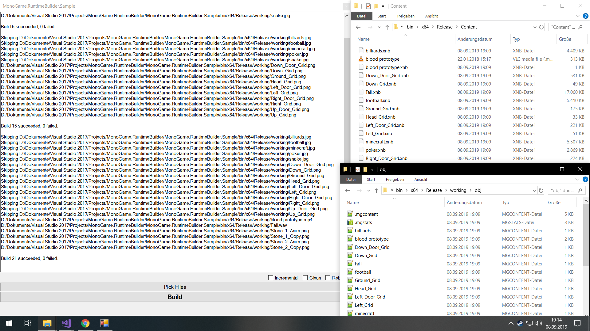

# Welcome to the MonoGame.RuntimeBuilder!
[](https://www.nuget.org/packages/MonoGame.RuntimeBuilder)

 The MonoGame.RuntimeBuilder **builds** your **raw** content **asynchronously** to the **.XNB** format **during runtime**. 
 
> This library is a part of the [MonoGame.Forms](https://github.com/sqrMin1/MonoGame.Forms) project, 
but it is fully usable without the MonoGame.Forms library!



 ---
 
### Tutorial

Using the MonoGame.RuntimeBuilder is fairly easy:

```c

// Creating the property.
private RuntimeBuilder _RuntimeBuilder { get; set; }

// Initialize the RuntimeBuilder.
_RuntimeBuilder = new RuntimeBuilder(
                Path.Combine(Application.StartupPath, "working"),           // working directory
                Path.Combine(Application.StartupPath, "working", "obj"),    // intermediate directory
                Path.Combine(Application.StartupPath, "Content"),           // output directory
                TargetPlatform.Windows,                                     // target platform
                GraphicsProfile.Reach,                                      // graphics profile
                true)                                                       // compress the content
            {
                Logger = new StringBuilderLogger()                          // logger
            };
            
// Pick Files & Build Content.
private async void ButtonPickFiles_Click(object sender, System.EventArgs e)
{
    if (openFileDialog.ShowDialog() == DialogResult.OK)
    {
        _RuntimeBuilder.RegisterBuildContent(openFileDialog.FileNames);
        await _RuntimeBuilder.BuildContent();
    }
}
```

And... that's it!

A content build list will be generated for you so that in case you just want to rebuild your files, you simply need to call **_RuntimeBuilder.BuildContent();** (without parameters) again.

The [RuntimeBuilder.cs](https://github.com/sqrMin1/MonoGame.RuntimeBuilder/blob/master/MonoGame.RuntimeBuilder/RuntimeBuilder.cs#L12-L16) class is actually just a wrapper around the original [MGCB](https://github.com/MonoGame/MonoGame/tree/develop/Tools/MGCB "MonoGame.Content.Builder") tool, so it contains all of its features and functionality. Take a look at it and you will see that everything is pretty self-explanatory.

Just one note:

To get log information you need to use a **ContentBuildLogger**. You can also inherit from this class to build your own logger.

Fortunately this library already contains a [StringBuilderLogger](https://github.com/sqrMin1/MonoGame.RuntimeBuilder/blob/master/MonoGame.RuntimeBuilder/StringBuilderLogger.cs#L8-L13) as an example :)

There is generally a [sample project](https://github.com/sqrMin1/MonoGame.RuntimeBuilder/blob/master/MonoGame.RuntimeBuilder.Sample/Sample.cs#L8) included in this repo, which shows pretty much everything. It's fully documented (comments) as well as the most important parts of the library.

### Now Have Fun with the MonoGame.RuntimeBuilder!


